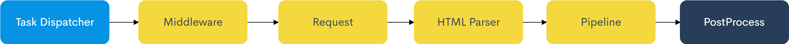

# YouCrawl


[](https://app.fossa.com/projects/git%2Bgithub.com%2FAllenTom%2FYouCrawl?ref=badge_shield)
[](https://codecov.io/gh/AllenTom/YouCrawl)
[](https://bettercodehub.com/)

[简体中文](doc/zh-cn.md) | [English](./README.md)

Go crawl library

## Install
```
go get -u github.com/allentom/youcrawl
```
## Features
HTML parser : [PuerkitoBio/goquery](https://github.com/PuerkitoBio/goquery)
## Workflow



The yellow part will be executed in parallel


The crawler library contains the following components, which can be added as needed

1. [Middleware](doc/en/middleware.md)
2. [HTML Parser](doc/en/parser.md)
3. [Pipeline](doc/en/pipeline.md)
4. GlobalStore
5. [PostProcess](doc/en/post-process.md)
6. [Plugin](doc/en/plugin.md)

## The simplest example

Because most of the components are optional, no complicated code is required.

``` go
func main() {
    e := youcrawl.NewEngine(
		&youcrawl.EngineOption{
			// Up to 5 tasks at the same time
			MaxRequest: 5,
		},
	)
  e.AddURLs("http://www.example.com")
  e.RunAndWait()
}
```

The above code just request the web page. The following code will add some  components to show more features, the code will be a little complicated.

We will collect data from website and save into json file
```go
func main() {
    e := youcrawl.NewEngine(
		&youcrawl.EngineOption{
			// Up to 5 tasks at the same time
			MaxRequest: 5,
		},
    )
    // add url
    e.AddURLs("http://www.example.com")
    // add UserAgent Middleware, add random UserAgent when requested
    e.UseMiddleware(&youcrawl.UserAgentMiddleware{})
    // Add parser and get page title
	e.AddHTMLParser(func(doc *goquery.Document, ctx *youcrawl.Context) error {
		title := doc.Find("title").Text()
		fmt.Println(title)
		ctx.Item.SetValue("title", title)
		return nil
    })
    // add Pipeline to store the item to the items in the GlobalStore
    e.AddPipelines(&youcrawl.GlobalStorePipeline{})
    // write the data under the `items` field in GlobalStore to the json file
	e.AddPostProcess(&youcrawl.OutputJsonPostProcess{
		StorePath: "./output.json",
	})
  e.RunAndWait()
}
```

## License
[](https://app.fossa.com/projects/git%2Bgithub.com%2FAllenTom%2FYouCrawl?ref=badge_large)
