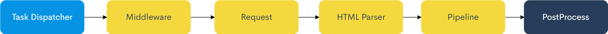

# YouCrawl


[](https://app.fossa.com/projects/git%2Bgithub.com%2FAllenTom%2FYouCrawl?ref=badge_shield)
[](https://codecov.io/gh/AllenTom/YouCrawl)
[](https://bettercodehub.com/)

[简体中文](doc/zh-cn.md) | [English](../README.md)

使用Go语言实现的爬虫库
## 安装
```
go get github.com/allentom/youcrawl
```
## 功能
HTML parser : [PuerkitoBio/goquery](https://github.com/PuerkitoBio/goquery)
## Workflow 工作原理


黄色部分会并行的执行

爬虫库包含下列组件，可以根据需要自行添加
1. [Middleware](./middleware.md)
2. [HTML Parser](./parser.md)
3. [Pipeline](./pipeline.md)
4. GlobalStore
5. [PostProcess](./post-process.md)

## 最简单的示例

由于大部分组件是可选的，并不需要非常复杂的代码。

``` go
func main() {
    e := youcrawl.NewEngine(
		&youcrawl.EngineOption{
			// 最多同时进行5个任务
			MaxRequest: 5,
		},
    )
    e.AddURLs("http://www.example.com")
    e.RunAndWait()
}
```

上面的代码仅仅只是请求了网页，下面会添加组件，代码会稍微复杂一点

```go
func main() {
    e := youcrawl.NewEngine(
		&youcrawl.EngineOption{
			// 最多同时进行5个任务
			MaxRequest: 5,
		},
    )
    // 添加url
    e.AddURLs("http://www.example.com")
    // 添加UserAgent Middleware，实现随机UA
    e.UseMiddleware(&youcrawl.UserAgentMiddleware{})
    // 添加 parser 并获取网页标题
	e.AddHTMLParser(func(doc *goquery.Document, ctx *youcrawl.Context) error {
		title := doc.Find("title").Text()
		fmt.Println(title)
		ctx.Item.SetValue("title", title)
		return nil
    })
    //添加Pipeline 将Item储存至GlobalStore中的items内
    e.AddPipelines(&youcrawl.GlobalStorePipeline{})
    //将GlobalStore内的items字段下的数据写入json文件
	e.AddPostProcess(&youcrawl.OutputJsonPostProcess{
		StorePath: "./output.json",
	})
	e.RunAndWait()
}

```

## License
[](https://app.fossa.com/projects/git%2Bgithub.com%2FAllenTom%2FYouCrawl?ref=badge_large)
